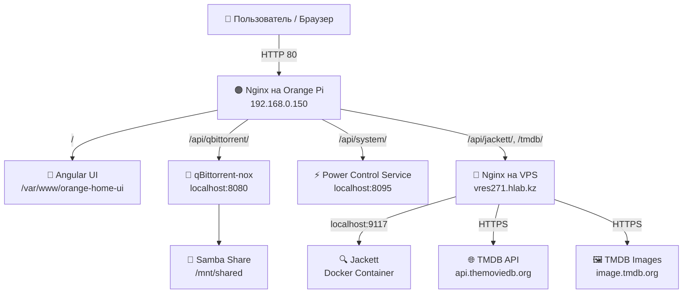

# 🎬 Home Media Torrent System

Веб-приложение для поиска и загрузки торрентов с метаданными из TMDB. Гибридная архитектура: домашний сервер (Orange Pi) управляет загрузками и отдает UI, а облачный VPS выступает защищенным прокси для обхода блокировок TMDB и хостинга Jackett.

## 🏗 Архитектура



### 🧩 Компоненты
| Компонент | Хост | Назначение |
| :--- | :--- | :--- |
| **Angular UI** | Orange Pi | SPA-приложение. Раздается статически через Nginx. |
| **Nginx (Edge)** | Orange Pi | Reverse proxy. Маршрутизирует запросы к локальным сервисам и на VPS. |
| **qBittorrent-nox** | Orange Pi | Торрент-клиент. Управляется через API. |
| **Power Control** | Orange Pi | Python/Flask сервис для безопасного перезапуска/выключения устройства. |
| **Nginx (Proxy)** | VPS | Reverse proxy. Обходит блокировки TMDB (SNI + Host header). |
| **Jackett** | VPS | Агрегатор индексеров в Docker. |

---

## 📂 Структура скриптов развертывания

Проект использует идемпотентные bash-скрипты. Их можно запускать многократно.

```text
📁 vps/
 ├── jackett.sh       # Установка Docker и запуск контейнера Jackett
 └── nginx.sh         # Настройка Nginx Reverse Proxy (TMDB + Jackett)

📁 orange-home-server/
 ├── nginx.sh               # Настройка Nginx, папки UI и правил проксирования
 ├── qbittorrent-samba.sh   # Установка торрент-клиента, создание пользователя и сетевой папки
 ├── power-control.sh       # Установка и настройка сервиса управления питанием
 └── deploy-ui.sh           # 🚀 Скрипт обновления: скачивает последний релиз с GitHub и распаковывает его
```

---

## 🚀 Развертывание системы

### Этап 1: Настройка VPS
1. Подключитесь к VPS по SSH.
2. Перейдите в папку `vps/`.
3. Запустите `bash jackett.sh`. 
   > ⚠️ **Важно:** После запуска откройте `http://<VPS_IP>:9117`, задайте пароль администратора и скопируйте API-ключ.
4. Запустите `bash nginx.sh`. Скрипт настроит проксирование и автоматически проверит доступность TMDB и Jackett.

### Этап 2: Настройка Orange Pi
1. Подключитесь к Orange Pi по SSH.
2. Перейдите в папку `orange-home-server/`.
3. Выполните скрипты по порядку:
   ```bash
   sudo bash nginx.sh
   sudo bash qbittorrent-samba.sh   # Скрипт попросит задать пароль для Samba
   sudo bash power-control.sh
   ```
4. **Первичная настройка qBittorrent:** Зайдите в WebUI (`http://<OrangePi_IP>:8080`), логин/пароль по умолчанию: `admin` / `adminadmin`. **Смените пароль** и укажите путь сохранения `/mnt/shared`.

### Этап 3: Деплой и обновление Frontend (для пользователя)
Сборка и публикация интерфейса выполняется на машине разработчика через `npm run release` (см. `release.js`). 

Для установки или обновления интерфейса **на сервере** не требуется Node.js или сборка. Просто выполните на Orange Pi:
```bash
sudo bash deploy-ui.sh
```
Этот скрипт автоматически:
1. Обратится к GitHub API и найдет последний релиз.
2. Скачает архив `orange-home-ui-v*.tar.gz`.
3. Безопасно заменит файлы в `/var/www/orange-home-ui`.
4. Выставит корректные права для Nginx (`www-data`).

---

## ⚙️ Конфигурация Angular

В файле `environment.ts` укажите базовый URL вашего Orange Pi. Все запросы к API должны быть относительными, чтобы их перехватывал локальный Nginx:

```typescript
export const environment = {
  production: true,
  baseUrl: 'http://192.168.0.150', // IP вашего Orange Pi
  
  // Ключи (можно вынести в assets/config.json для безопасности)
  tmdbApiKey: '10c34eac115400ee04361d62d80bcd8a',
  jackettApiKey: 'ВАШ_КЛЮЧ_ИЗ_ЭТАПА_1',
  
  endpoints: {
    tmdb: '/tmdb/3',
    tmdbImages: '/tmdb-images',
    jackett: '/api/jackett/api/v2.0',
    qbittorrent: '/api/qbittorrent/api/v2',
    system: '/api/system'
  }
};
```

---

## 🛠️ Troubleshooting

| Симптом | Причина | Решение |
| :--- | :--- | :--- |
| **502 Bad Gateway** на `/tmdb/` | Nginx на VPS не может установить HTTPS с TMDB. | Проверьте наличие `proxy_ssl_server_name on;` в `vps/nginx.sh`. |
| **CORS ошибки** в браузере | Фронтенд стучится напрямую на VPS, минуя Nginx Orange Pi. | Убедитесь, что в Angular `baseUrl` указывает на Orange Pi, а эндпоинты относительные. |
| **Версия UI не обновилась** | Браузер закэшировал старый `index.html`. | Скрипт `deploy-ui.sh` корректно настроен, но попробуйте жесткую перезагрузку (`Ctrl+F5`). Конфиг Nginx уже запрещает кэширование `version.json`. |
